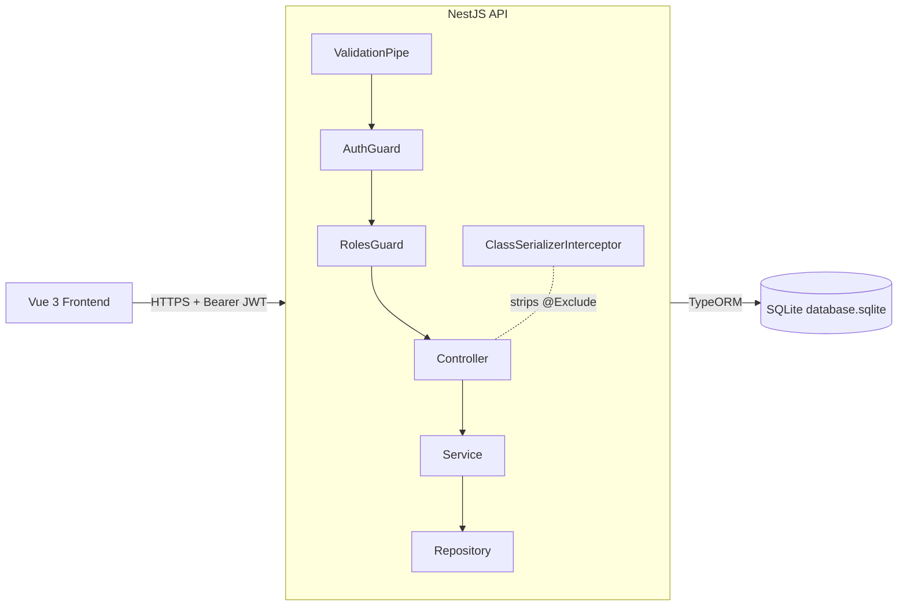

# Package Monitoring Dashboard — Backend

REST API in **NestJS 11** that powers the Vue frontend of the Package Monitoring Dashboard. Uses **TypeORM** with **SQLite** for persistence and **JWT + bcrypt** for authentication and authorization.

## Tech stack

| Layer | Choice |
|---|---|
| Framework | NestJS 11 (Node 20+) |
| Language | TypeScript 5.7 (strict null checks) |
| ORM | TypeORM 0.3 |
| Database | SQLite (dev); easily swappable to Postgres/MySQL |
| Auth | `@nestjs/jwt` for tokens, `bcrypt` for password hashing |
| Validation | `class-validator` + `class-transformer` |
| Lint / Format | ESLint 9 (flat config), Prettier 3 |

## Folder structure

```
backend/
├── src/
│   ├── auth/                 # JWT auth: login, register, profile, guards, roles
│   │   ├── decorators/       # @Roles() metadata decorator
│   │   ├── dto/              # SignIn / Register payloads
│   │   ├── guards/           # AuthGuard + RolesGuard
│   │   └── *.ts              # module / controller / service / constants
│   ├── users/                # User CRUD (Admin-gated)
│   │   ├── dto/              # Create / Update DTOs
│   │   └── entities/         # User TypeORM entity
│   ├── warehouses/           # Warehouse CRUD (Admin-gated mutations)
│   ├── packages/             # Package CRUD (any authenticated user)
│   ├── package-logs/         # PackageLog CRUD + GET /by-package/:id
│   ├── interfaces/auth/      # JWT payload + Express Request typings
│   ├── types/                # Shared union aliases (Role, PackageStatus)
│   ├── app.module.ts         # Root module wiring
│   └── main.ts               # Bootstrap, CORS, ValidationPipe, ClassSerializerInterceptor
├── docs/
│   ├── architecture.md       # Layers, class diagram, ER diagram, module graph
│   ├── authentication.md     # JWT flow, role enforcement, sequence diagrams
│   └── api-reference.md      # Endpoint catalog with curl examples
├── nest-cli.json
├── tsconfig.json
└── package.json
```

## Quick start

```bash
# Install dependencies
npm install

# Run in watch mode (recompiles on save)
npm run start:dev

# Production build
npm run build && npm run start:prod
```

The API listens on `http://localhost:3000` with global prefix `/api`.

## Environment variables

All optional — sane defaults are baked in.

| Variable | Default | What it does |
|---|---|---|
| `PORT` | `3000` | HTTP port the API listens on |
| `CORS_ORIGIN` | `http://localhost:5173,http://localhost,http://127.0.0.1` | Comma-separated origins allowed by CORS |
| `SQLITE_PATH` | `database.sqlite` | Path to the SQLite DB file (relative to `backend/`) |

To override, copy the template and edit:

```bash
cp .env.example .env
# edit values, then start the dev server normally
npm run start:dev
```

`.env` is gitignored; `.env.example` is committed. The JWT signing secret lives in `src/auth/constants.ts` (not in env).

## Database (SQLite)

The connection lives in `src/app.module.ts`:

```ts
TypeOrmModule.forRoot({
  type: 'sqlite',
  database: process.env.SQLITE_PATH ?? 'database.sqlite',
  autoLoadEntities: true,
  synchronize: true,
}),
```

What that means:

- **`type: 'sqlite'`** — uses a single file, no server to install.
- **`database`** — the SQLite file. Created automatically on first boot at `backend/database.sqlite`.
- **`autoLoadEntities: true`** — TypeORM picks up every entity registered with `TypeOrmModule.forFeature([Entity])` in any imported module. No manual list to maintain.
- **`synchronize: true`** — schema is rebuilt from the entity classes on every start. Great for dev; lose your data if you rename a property.

### Adding a new entity

1. Create `src/<feature>/entities/<feature>.entity.ts` decorated with `@Entity()` + column decorators.
2. Register it in the feature module: `imports: [TypeOrmModule.forFeature([Feature])]`.
3. Import the feature module from `AppModule`.
4. Restart `npm run start:dev`. The table is created automatically.

### Inspecting the database

```bash
# CLI
sqlite3 backend/database.sqlite
> .tables
> SELECT * FROM "user";
```

GUI: open `backend/database.sqlite` in **DBeaver** (New Connection → SQLite → set Path) or **DB Browser for SQLite** (`sqlitebrowser backend/database.sqlite`). Stop the backend before writing from a GUI to avoid locks; reads are safe while it runs.

### Resetting the database

```bash
# Stop the backend, delete the file, restart — schema is rebuilt automatically
rm backend/database.sqlite
npm run start:dev
```

## Docker

Build and run just the backend container:

```bash
docker build -t packtrack-backend .
docker run -p 3000:3000 -v packtrack-data:/data \
  -e SQLITE_PATH=/data/database.sqlite \
  packtrack-backend
```

Or run the full stack (backend + frontend) from the project root:

```bash
cd ..
docker compose up -d
```

See the root README for the full Docker workflow.

## High-level architecture



## Documentation index

- **[Architecture](./docs/architecture.md)** — class diagram, ER diagram, module graph, folder conventions.
- **[Authentication and authorization](./docs/authentication.md)** — JWT flow sequence diagrams, RolesGuard logic, permissions matrix.
- **[API reference](./docs/api-reference.md)** — every endpoint with method, payload, response, required role, and curl examples.

## Available scripts

| Command | Description |
|---|---|
| `npm run start` | Start once (no watch) |
| `npm run start:dev` | Start with file watcher (recommended for dev) |
| `npm run start:prod` | Run the compiled `dist/main.js` |
| `npm run build` | Compile TypeScript to `dist/` |
| `npm run lint` | ESLint with `--fix` |
| `npm run format` | Prettier on `src/**/*.ts` and `test/**/*.ts` |
| `npm run test` | Jest unit tests (none currently authored) |

## Conventions

- Folders are plural (`users/`, `warehouses/`, `packages/`, `package-logs/`).
- DTO filenames are kebab-case with the `.dto.ts` suffix; updates use `PartialType(CreateXxxDto)`.
- Imports are grouped with `// External imports` and `// Internal imports` comment blocks.
- Type-only imports use `import type { Foo }` for shared unions and interfaces.
- All controller and service methods declare explicit `Promise<T>` return types.
- `ValidationPipe` runs globally with `whitelist: true`, `forbidNonWhitelisted: true`, `transform: true` — unknown payload fields cause a 400.
- `ClassSerializerInterceptor` runs globally so every response respects `@Exclude()` (User.password is never sent).

## Authors

Samuel Rivero, David Hdez (Law), Juan Andrés Young Hoyos
