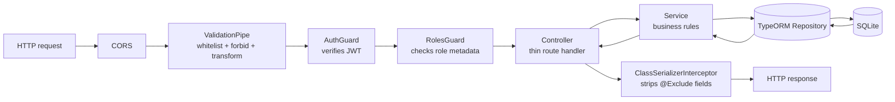
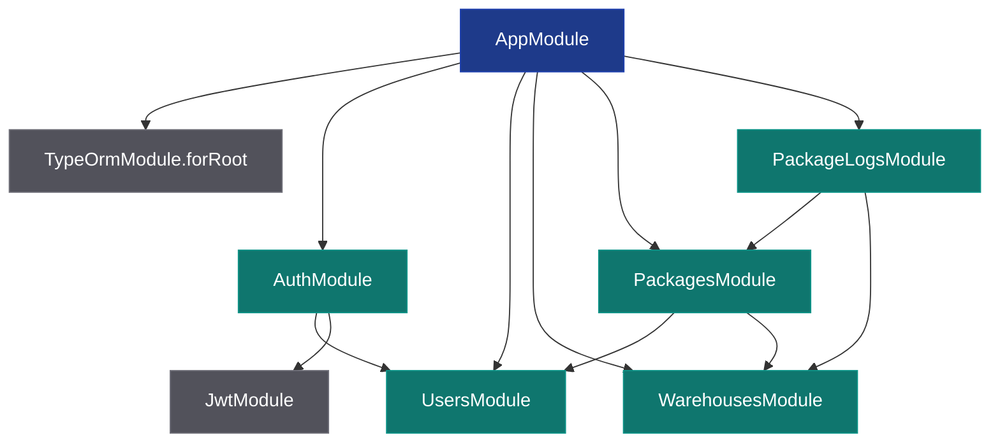
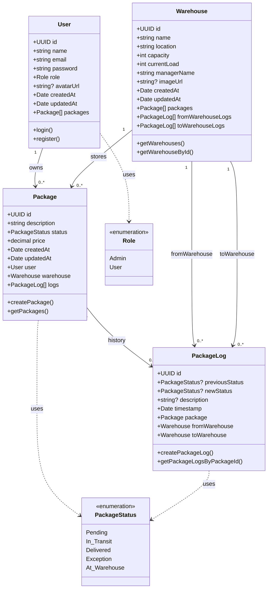
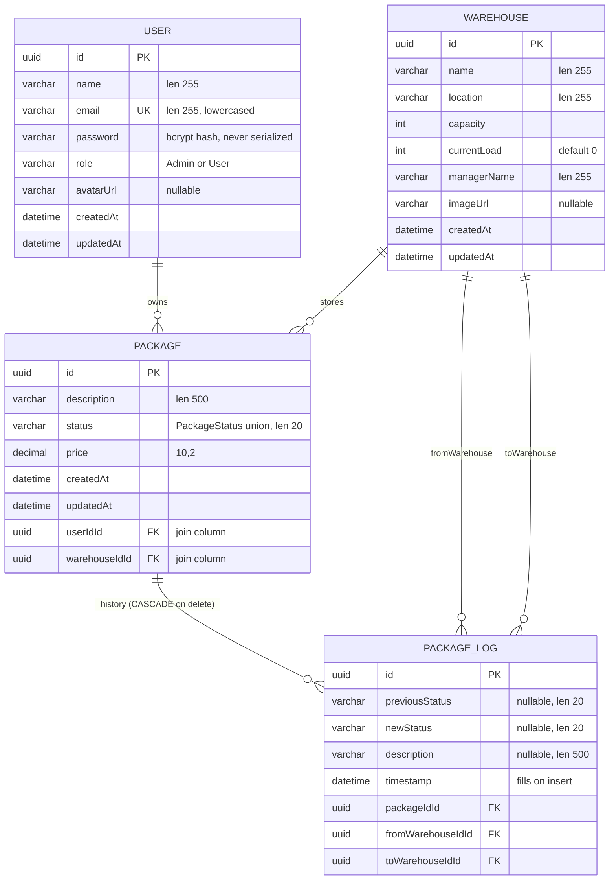

# Architecture

This backend follows a **feature-module** layout where each domain entity (User, Warehouse, Package, PackageLog) lives in its own NestJS module with a fixed shape:

```
<feature>/
├── <feature>.module.ts       # NestJS module definition
├── <feature>.controller.ts   # HTTP route handlers (thin)
├── <feature>.service.ts      # Business logic + repository access
├── dto/
│   ├── create-<feature>.dto.ts
│   └── update-<feature>.dto.ts   # PartialType(CreateXxxDto)
└── entities/
    └── <feature>.entity.ts   # TypeORM entity
```

Cross-module dependencies are explicit: a service from module A receives the service of module B via constructor injection, and module A imports module B in its `@Module({ imports })`.

## Request lifecycle



Guards run in order; if either fails the request is short-circuited (`401` from AuthGuard, `403` from RolesGuard) and never reaches the controller.

## Module dependency graph



`UsersModule` and `WarehousesModule` `export` their service so downstream modules can inject them without circular imports. `PackagesModule` re-exports `PackagesService` so `PackageLogsModule` can resolve a `Package` by id when validating log creation.

## Class diagram (domain model)



### Cardinality summary

| From | Direction | To | Decorator on the *many* side |
|---|---|---|---|
| User | 1 — 0..* | Package | `@ManyToOne(() => User, u => u.packages, { eager: true })` |
| Warehouse | 1 — 0..* | Package | `@ManyToOne(() => Warehouse, w => w.packages, { eager: true })` |
| Package | 1 — 0..* | PackageLog | `@ManyToOne(() => Package, p => p.logs, { eager: true, onDelete: 'CASCADE' })` |
| Warehouse | 1 — 0..* | PackageLog (`fromWarehouse`) | `@ManyToOne(() => Warehouse, w => w.fromWarehouseLogs, { eager: true })` |
| Warehouse | 1 — 0..* | PackageLog (`toWarehouse`) | `@ManyToOne(() => Warehouse, w => w.toWarehouseLogs, { eager: true })` |

`eager: true` means TypeORM auto-joins the parent on every query, so a `GET /api/packages` already returns nested `user` and `warehouse` objects without a custom `.find({ relations: [...] })`.

`onDelete: 'CASCADE'` on the `PackageLog → Package` relation means deleting a package wipes its logs automatically (the timeline becomes invalid without the parent).

> **Note on PackageStatus values:** the enum is rendered with underscores in the diagram (`In_Transit`, `At_Warehouse`) because Mermaid does not allow spaces in enumeration members. The actual string values stored in the database and accepted by the API contain spaces: `'Pending'`, `'In Transit'`, `'Delivered'`, `'Exception'`, `'At Warehouse'`. See `src/types/PackageTypes.ts`.

## Entity-relationship diagram (database)



> **Note on column names:** TypeORM generates join columns as `<relationName>Id` by default. With `synchronize: true` and `@JoinColumn()` left blank, you may see the actual columns as `userId`, `warehouseId`, `packageId`, `fromWarehouseId`, `toWarehouseId`. The duplication in the diagram (`userIdId`) is just to make the FK relationship visually obvious.

## Folder + file conventions

| Convention | Why |
|---|---|
| Folders plural (`users/`, `packages/`) | Matches NestJS schematics output and the team rulebook |
| One entity per file under `entities/` | Keeps imports unambiguous |
| `kebab-case.dto.ts` filenames | Avoids OS-case-sensitivity issues |
| `UpdateXxxDto extends PartialType(CreateXxxDto)` | Single source of truth for fields |
| `import type { Foo }` for unions/interfaces | TypeScript erases these at runtime — zero JS impact |
| Explicit `Promise<T>` return types | Lint rule `no-floating-promises` benefits, and clarifies async contracts |
| Constructor injection only | NestJS DI requires it; no `static` services |
| `@InjectRepository(Entity)` in services | Standard TypeORM ↔ NestJS bridge |
| Throw `NotFoundException` / `ConflictException` / `BadRequestException` from services | NestJS converts to 404/409/400 automatically |

## Persistence layer notes

- TypeORM `synchronize: true` is enabled. Schema changes auto-apply on app boot. **Do not enable this in production** — it can drop columns silently.
- `autoLoadEntities: true` discovers entities through `@Module({ imports: [TypeOrmModule.forFeature([Entity])] })`. No `entities: [...]` array is needed at the root level.
- The DB file lives at the project root (`backend/database.sqlite`) by default. Override with `SQLITE_PATH=...` when launching.
- WAL/journal files (`*.sqlite-journal`, `*.sqlite-wal`, `*.sqlite-shm`) are gitignored.
- **Default admin seeder**: on every boot, `seedDefaultAdmin()` in `src/main.ts` checks whether an admin account exists; if not, it creates one with credentials read from `SEED_ADMIN_EMAIL` / `SEED_ADMIN_PASSWORD` (defaults: `admin@packtrack.local` / `Admin12345!`). Set `SEED_ADMIN_ENABLED=false` to disable.

## Where to read the code

| Concern | Entry point |
|---|---|
| Bootstrap, CORS, global pipe + interceptor, default admin seeder | `src/main.ts` |
| Database connection + module list | `src/app.module.ts` |
| JWT signing config | `src/auth/auth.module.ts` (uses `src/auth/constants.ts`) |
| AuthGuard (token verification) | `src/auth/auth.guard.ts` |
| RolesGuard (role enforcement) | `src/auth/guards/roles.guard.ts` |
| `@Roles('Admin')` decorator | `src/auth/decorators/roles.decorator.ts` |
| Shared types | `src/types/UsersTypes.ts`, `src/types/PackageTypes.ts` |

For details on the auth flow, see [`authentication.md`](./authentication.md). For an endpoint-by-endpoint reference, see [`api-reference.md`](./api-reference.md).
