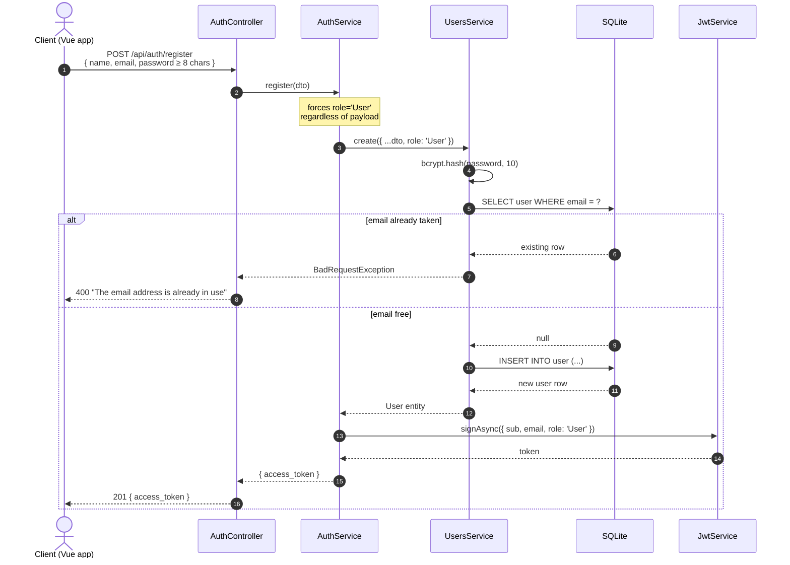
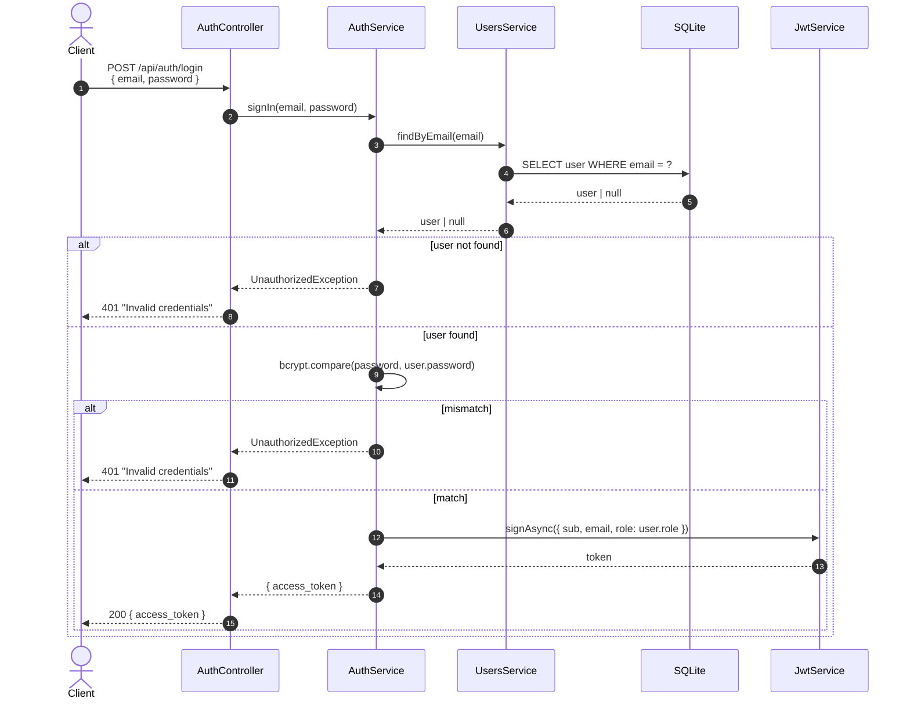
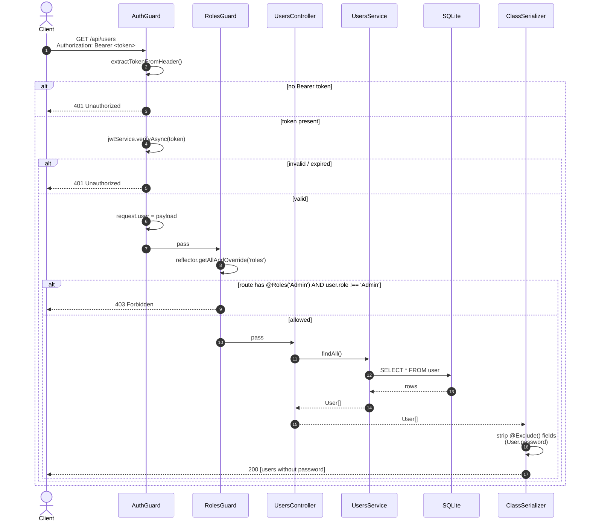

# Authentication & authorization

This API uses **stateless JWT** (HS256, 1h expiry) issued by `/auth/login` or `/auth/register`. Clients store the token and send it in the `Authorization: Bearer <token>` header on every protected request.

Authorization is **role-based** with two roles:

| Role | Granted to | Access |
|---|---|---|
| `User` | Public sign-up via `POST /auth/register` | Read everything; create/edit/delete own packages and logs |
| `Admin` | Auto-seeded on first boot (default account) or promoted via `PATCH /api/users/:id` by an existing admin | Full access to user/warehouse mutations |

Roles are enforced by combining two guards:

- **`AuthGuard`** — verifies the JWT, attaches its payload to `request.user`, throws `401 Unauthorized` if missing/invalid.
- **`RolesGuard`** — reads the `@Roles('Admin')` metadata off the route handler and compares against `request.user.role`. Throws `403 Forbidden` if mismatched.

## Sign-up flow



The `@Transform` decorator on the email field of every relevant DTO normalizes input to lowercase before validation, so `Foo@Bar.com` and `foo@bar.com` are treated as the same address.

## Login flow



> **Privacy nuance**: when the user doesn't exist, the API still returns the same `401 Invalid credentials` message it returns for a wrong password — it does **not** leak which side of the credential pair was wrong.

## Authenticated request with role check



## Permissions matrix

`Public` = no token needed. `User` and `Admin` mean an authenticated request whose JWT carries the corresponding role.

| Endpoint | Method | Public | User | Admin | Notes |
|---|---|:---:|:---:|:---:|---|
| `/api/auth/register` | POST | Yes | Yes | Yes | Always issues a User-role token |
| `/api/auth/login` | POST | Yes | Yes | Yes | |
| `/api/auth/profile` | GET | No | Yes | Yes | Returns the authenticated user |
| `/api/users` | GET | No | No | Yes | List all users |
| `/api/users/:id` | GET | No | Yes | Yes | Any authenticated user can fetch any user |
| `/api/users/:id` | PATCH | No | No | Yes | Edit user (incl. role promotion) |
| `/api/users/:id` | DELETE | No | No | Yes | |
| `/api/warehouses` | GET | No | Yes | Yes | |
| `/api/warehouses/:id` | GET | No | Yes | Yes | |
| `/api/warehouses` | POST | No | No | Yes | Create warehouse |
| `/api/warehouses/:id` | PATCH | No | No | Yes | |
| `/api/warehouses/:id` | DELETE | No | No | Yes | |
| `/api/packages` | GET | No | Yes | Yes | Returns all (frontend filters by owner if needed) |
| `/api/packages/:id` | GET | No | Yes | Yes | |
| `/api/packages` | POST | No | Yes | Yes | Any user can create |
| `/api/packages/:id` | PATCH | No | Yes | Yes | |
| `/api/packages/:id` | DELETE | No | Yes | Yes | |
| `/api/package-logs` | GET | No | Yes | Yes | |
| `/api/package-logs/:id` | GET | No | Yes | Yes | |
| `/api/package-logs/by-package/:packageId` | GET | No | Yes | Yes | Timeline for a single package |
| `/api/package-logs` | POST | No | Yes | Yes | Rejects `from === to` with 400 |
| `/api/package-logs/:id` | PATCH | No | Yes | Yes | Re-validates the warehouse pair |
| `/api/package-logs/:id` | DELETE | No | Yes | Yes | |

## Default admin account

There is **no public endpoint** to create or upgrade an Admin — by design (the public `POST /auth/register` always assigns `role: 'User'`, regardless of payload). Instead, the backend ships with a **default admin seeder** that runs on every boot.

### How the seeder works

`src/main.ts` calls `seedDefaultAdmin(app)` right before `app.listen(...)`. The seeder:

1. Reads `SEED_ADMIN_EMAIL` (default `admin@packtrack.local`) and looks it up via `UsersService.findByEmail`.
2. If a user with that email already exists, the seeder exits silently — no overwrite, no surprise.
3. If not, it calls `UsersService.create({ name, email, password, role: 'Admin' })`, which hashes the password with bcrypt and inserts the row.
4. It logs `Seeded default admin account: <email>` via the Nest `Logger` so you can see it on first boot.

### Default credentials

| Field | Value |
|---|---|
| Email | `admin@packtrack.local` |
| Password | `Admin12345!` |
| Name | `Admin User` |

A new contributor that clones the repo and runs `npm run start:dev` (or `docker compose up -d`) can log in immediately with these credentials. **Change them through env vars before any non-local deployment.**

### Customizing the seeder via env vars

| Variable | Default | What it controls |
|---|---|---|
| `SEED_ADMIN_ENABLED` | `true` | Set to `false` to skip seeding entirely |
| `SEED_ADMIN_NAME` | `Admin User` | Display name |
| `SEED_ADMIN_EMAIL` | `admin@packtrack.local` | Email (lowercased before lookup) |
| `SEED_ADMIN_PASSWORD` | `Admin12345!` | Plain password (bcrypt-hashed by the service) |

### Promoting other users to Admin

Once the default admin exists, additional admins are promoted through the API:

```bash
# Login as the default admin to get a token
ADMIN_TOKEN=$(curl -s -X POST http://localhost:3000/api/auth/login \
  -H "Content-Type: application/json" \
  -d '{"email":"admin@packtrack.local","password":"Admin12345!"}' | jq -r .access_token)

# Promote another user (you need their UUID)
curl -X PATCH http://localhost:3000/api/users/$TARGET_USER_ID \
  -H "Authorization: Bearer $ADMIN_TOKEN" \
  -H "Content-Type: application/json" \
  -d '{"role":"Admin"}'
```

The promoted user must **log out and log in again** so their new JWT carries `role: 'Admin'`. Until then, the old token still says `role: 'User'` and the `RolesGuard` will return 403 on admin-only endpoints.

## JWT shape

```jsonc
// Header
{ "alg": "HS256", "typ": "JWT" }

// Payload (the AuthGuard places this on request.user)
{
  "sub":   "f7b7a353-773b-4b57-90fa-bf4f7cddd247",  // User UUID
  "email": "juan@test.com",
  "role":  "User",
  "iat":   1777166668,
  "exp":   1777170268                                 // sub + 1h
}
```

The signing secret lives in `src/auth/constants.ts` as `jwtConstants.secret`. For a production-grade build it should be moved to `process.env.JWT_SECRET` and rotated periodically — left in code for this delivery to match the reference team's pattern and keep setup zero-config.

## Password hashing

- **Algorithm**: `bcrypt` (Blowfish-based) with cost factor `10` → ~10 hashes/sec on a 2020 laptop, which is the recommended OWASP minimum.
- **Salt**: bcrypt generates one per hash; stored inside the hash string itself (the `$2b$10$<salt><hash>` format).
- **Never serialized**: the User entity has `@Exclude()` on its `password` column. Combined with the global `ClassSerializerInterceptor`, the field is automatically stripped from every response — even when nested inside a Package or PackageLog.

## Defense-in-depth checklist

| Mechanism | Status | Where |
|---|---|---|
| HTTPS in production | Out of scope (delivery runs locally) | `main.ts` listens plain HTTP |
| Password hashing | Done — bcrypt cost 10 | `users.service.ts` |
| Password length validation | Done — `@MinLength(8)` | `create-user.dto.ts`, `register.dto.ts` |
| Email normalization | Done — trim + lowercase via `@Transform` | DTOs |
| JWT verification on every protected route | Done — class-level `@UseGuards(AuthGuard)` | each controller |
| Role check on admin routes | Done — `@UseGuards(AuthGuard, RolesGuard) @Roles('Admin')` | users + warehouse controllers |
| Strip secrets from responses | Done — `ClassSerializerInterceptor` global + `@Exclude()` | `main.ts` + `user.entity.ts` |
| Reject unknown payload fields | Done — `forbidNonWhitelisted: true` | `main.ts` ValidationPipe |
| Strict CORS | Done — explicit origin list | `main.ts` |
| Public registration cannot escalate | Done — `RegisterDto` has no `role` field; `authService.register` overrides to `'User'` | `auth.service.ts` |
| Admin bootstrap is reproducible | Done — idempotent seeder runs on every boot; never overwrites an existing admin | `main.ts` (`seedDefaultAdmin`) |
